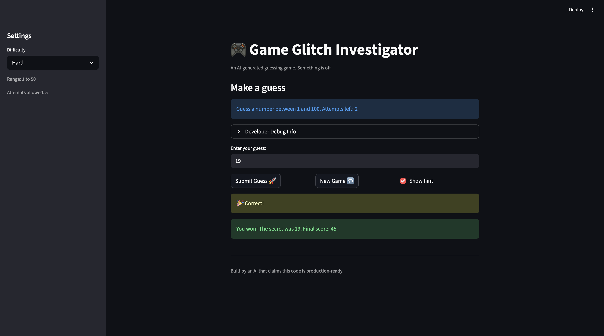

# 🎮 Game Glitch Investigator: The Impossible Guesser

## 🚨 The Situation

You asked an AI to build a simple "Number Guessing Game" using Streamlit.
It wrote the code, ran away, and now the game is unplayable. 

- You can't win.
- The hints lie to you.
- The secret number seems to have commitment issues.

## 🛠️ Setup

1. Install dependencies: `pip install -r requirements.txt`
2. Run the broken app: `python -m streamlit run app.py`

## 🕵️‍♂️ Your Mission

1. **Play the game.** Open the "Developer Debug Info" tab in the app to see the secret number. Try to win.
2. **Find the State Bug.** Why does the secret number change every time you click "Submit"? Ask ChatGPT: *"How do I keep a variable from resetting in Streamlit when I click a button?"*
3. **Fix the Logic.** The hints ("Higher/Lower") are wrong. Fix them.
4. **Refactor & Test.** - Move the logic into `logic_utils.py`.
   - Run `pytest` in your terminal.
   - Keep fixing until all tests pass!

## 📝 Document Your Experience

- [x] Describe the game's purpose.

**The game's purpose is to guess the secret number the program is thinking of, and it gives you clues on whether you should guess higher or lower. it also has difficulty levels with a certain number of attempts to make the game easier or harder.**

- [x] Detail which bugs you found.

- **Bug 1:** I found was that the Higher/Lower logic was flawed. When I guessed a number higher than the secret target, it told me to go higher and vice versa.
- **Bug 2:** I found was that there weren't bounds for choosing a number from 1 to 100, so when I chose a negative number or a number over 100, it didn't give an error message for that, and I got away with it
- **Bug 3:** When I tried starting a new game, the attempts I made didn't clear and refresh
- **Bug 4:** I saw a miscorrelation with attempts left and attempts allowed when i started a new game. Initially, it showed n Attempts Allowed but it showed n-1 Attempts Left. I also saw a message saying I ran out of attempts even though I had one attempt left
- **Bug 5:** The number of attempts didn't decrement and it wasn't added in the History array when i locked in my guess and submitted my guess. i had to click it again

- [x] Explain what fixes you applied.

**I was able to fix the first error by switching the Higher and Lower messages in the guessing logic, and I was able to fix the second error by adding bounds ensuring the user choose a number greater than or equal to 1 OR less than or equal to 100.**

**For Bug 3 I initialized a new array whenever new_game was true, and for Bug 4, I changed the initial session state attempts from 1 to 0. Also I changed the sign from >= to >, which keeps track of the number of current attempts and the attempt limit, accurately telling us that we're out of attempts when we have 0 attempts left**

## 📸 Demo

## 🚀 Stretch Features

- [ ] [If you choose to complete Challenge 4, insert a screenshot of your Enhanced Game UI here]
